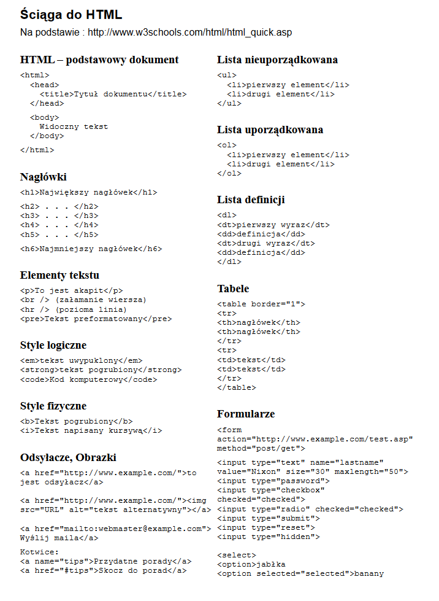
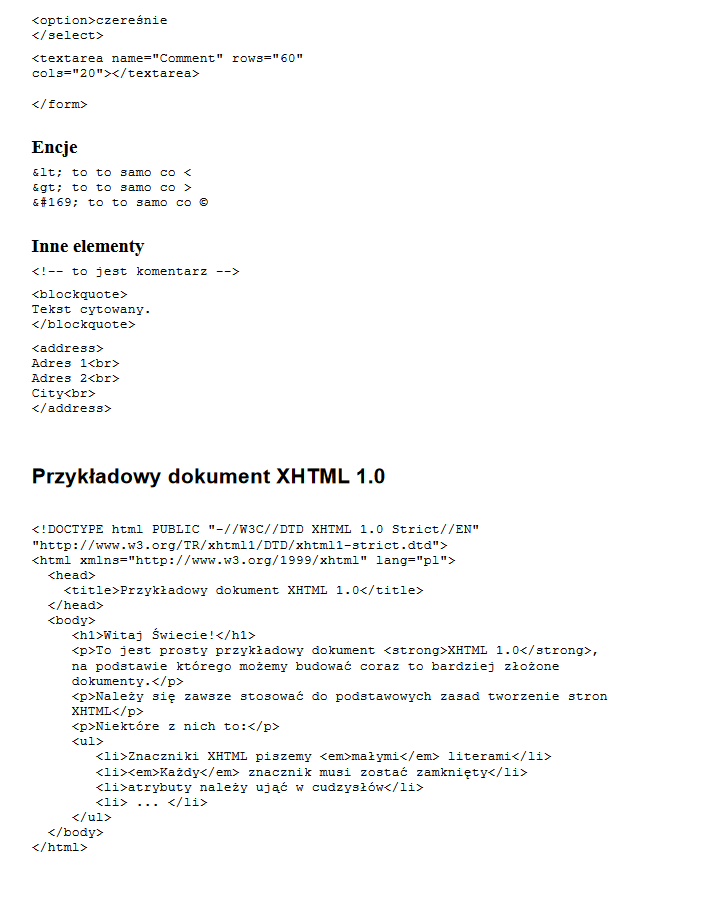

# Lekcja 4

<html>
<h1>Ściąga CSS</h1>

<table>
<tr>
  <th colspan="2">
    Czcionka
  </th>
  </tr>
  <tr>
    <td>font-size:</td>
    <td>wielkość np. 16px</td>
  </tr>
  <tr>
    <td>font-family:</td>
    <td>typ czcionki np. Oswald, sans-serif</td>
  </tr>
  <tr>
    <td>font-weight:</td>
    <td>grubość czcionki np. bold, normal</td>
  </tr>
  
  <tr>
    <th colspan="2">Box-model</th>
  </tr>
  <tr>
    <td>width:</td>
    <td>rozmiar w px np. 600px</td>
  </tr>
  <tr>
  <td>height:</td>
    <td>wysokość np. 300px</td>
  </tr>
  <tr>
  <td>margin-top:</td>
  <td>margines górny (na zewnątrz elementu) </td>
  </tr>
  <tr>
  <td>margin-right:</td>
  <td>margines prawy (na zewnątrz elementu) </td>
  </tr>
  <tr>
  <td>margin-bottom:</td>
  <td>margines dolny (na zewnątrz elementu) </td>
  </tr>
  <tr>
  <td>margin-left:</td>
  <td>margines lewy (na zewnątrz elementu) </td>
  </tr>
  <tr>
    <td>padding-top:</td>
    <td>odległość od górnej krawędzi (wewnątrz elementu)</td>
  </tr>
  <tr>
    <td>padding-right:</td>
    <td>odległość od prawej krawędzi (wewnątrz elementu)</td>
  </tr>
  <tr>
    <td>padding-bottom:</td>
    <td>odległość od dolnej krawędzi (wewnątrz elementu)</td>
  </tr>
  <tr>
    <td>padding-left:</td>
    <td>odległość od lewej krawędzi (wewnątrz elementu)</td>
  </tr>
  <tr>
  <th colspan="2">Kolory i tła</th>
  </tr>
  <tr>
    <td>color:</td>
    <td>kolor tekstu np. #000000 | black | red  | blue | pink | #1a1e49</td>
  </tr>
  <tr>
  <td>background-color:</td>
  <td>kolor tła np. #000000 | black | red  | blue | pink | #1a1e49</td>
  </tr>
  <tr>
  <td>background-image:</td>
  <td>obrazek tła np. url('tutaj podajemy sciezke do obrazka')</td>
  </tr>
  <tr>
  <td>background-repeat:</td>
  <td>powtarzanie tła np. repeat | no-repeat</td>
  </tr>
  <tr>
  <td>background-position:</td>
  <td>położenie obrazka tła np. center | top | bottom | w px</td>
  </tr>
  <tr>
  <th colspan="2">Obramowanie</th>
  </tr>
  <tr>
  <td>border-width</td>
  <td>wielkość obramowania</td>
  </tr>
  <tr>
  <td>border-color</td>
  <td>kolor obramowania</td></tr>
  <tr>
  <td>border-style</td>
  <td>typ obramowania np. none | hidden | dotted | dashed | solid | double | groove | ridge | inset | outset</td></tr>
  <tr>
    <th colspan="2">Tekst</th>
  </tr>
  <tr>
  <td>text-transform:</td>
  <td>formatowanie tekstu np. none | capitalize | uppercase | lowercase</td></tr>
  <tr>
  <td>text-align:</td>
  <td>wyrównanie tekstu np. left | right | center</td></tr>
  <tr>
  <td>text-decoration:</td>
  <td>ozdoba tekstu np. none | underline | overline | line-through | blink</td></tr>
  <tr>
  <td>letter-spacing:</td>
  <td>odległość między literami np. 1px</td></tr>
</table>
</html>